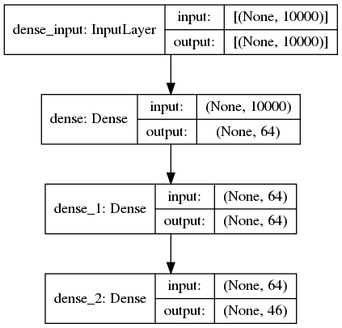

# Classifying newswires

Another example from the book "Deep Learning with Python" from Francois Chollet.
We build in a network to classify Reuters newswires into 46 mutually exclusive topics.
Each datapoint should be classified into only one category, i.e. it's an instance of single-label, multiclass classification.

## Net architecture for newswire classification

